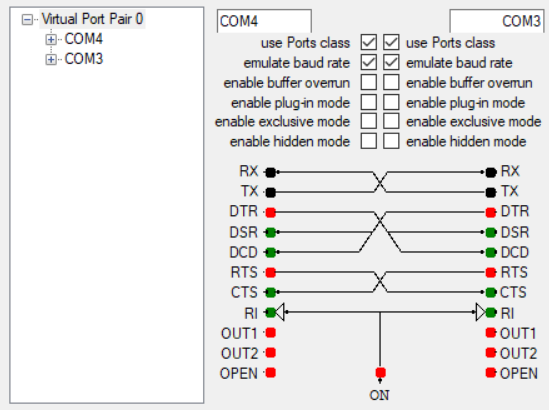
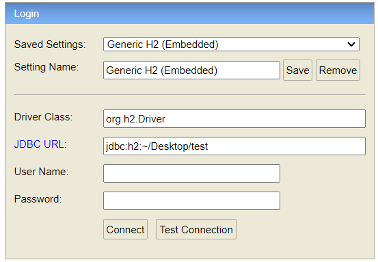

[*] excusez les fautes d'orthographe

Cette repository va être la base de l'application intégrée qui reçoit les informations à partir du ccu et les persiste dans la base de données.

Le repository contient plusieurs classes cle qui convergent vers ce but.
- On a XmodemReceiver qui permet la réception d'un fichier via Xmodem CRC
- Diagnostic File Recorder qui permet de décoder le relevé du CCU
- Les classes modèles de la base de données et la couche DAO.
- Une première version du programme qui capture les messages de CCU en temps réel et les persiste dans la base de données, C’est la classe Main.

Le projet est initié avec Intellij IDEA  mais il suit la structure du fichier d’un projet Maven normal.
Pour exécuter le projet ca sera mieux de l'ouvrir dans un IDE, comme ca vous pouvez exécuter les test unitair, et jouer avec le code. Si non vous pouvez utiliser Maven command pour générer un JAR et l'exécuter comme un programme java normal, dans ce cas seulement le test de la première version du programme sera lancé.

# Les fichiers inclus dans le projet en dehors du code source:
**Output**: c’est un relevé du CCU déjà téléchargé,  vous pouvez l’utiliser pour test Diagnostic File Recorder. (le test est dans les tests unitaires).

**Out.csv**: C’est le fichier transcodé correspondant au relevé (Output)

**Resources.xml**: C’est un fichier XML qui contient les informations sur les codes des pannes/événements.

**breakdown.txt**: C’est un fichier txt qui contient des messages capture du CCU, on l'utilise dans le test de la première version du programme pour simuler CCU envoyant les messages.

# Les prerequis:
Vous aurez besoin de:

JDK 21

Preferablement un IDE

Et Pour que vous pouvez effectuer quelque test unitaire ainsi que le test de la première version du program, vous devez installer un émulateur de connection serial qui va créer un paire de port seriel virtual connecte, comme ça on peut simuler la présence du CCU

```https://com0com.sourceforge.net/```

À l'installation il va créer un paire de port connecté. Pour moi, il sont COM3 et COM4 si c’est le cas pour vous c’est ok, sinon vous serez obligé de modifier le code pour qu’il fonctionne.



# Plus d'informations sur le test du premier version du program:
Quesqu’il fait ?
- Recevoir  les messages de la connection serial
- Extraire les informations des événements/pannes
- Sauvegarder les informations dans la base de données

vous exécutez le programme et voyez dans la base de données que les données sont effectivement sauvgardees.

# Concernant la base de données
On est dans la phase de test et donc j’ai utilisé H2 Database. C’est base de données peut fonctionner dans le mode “embedded” c’est à dire que on’a pas besoin d' installer un serveur base de données pour supporter le program, par contre la base de données va être  lancée avec le program.
H2 dispose d'une interface graphique que l'on peut utiliser pour interagir avec.

Lorsque vous lancez le programme, elle est accessible via
```
localhost:8082
127.0.0.1:8082
```


Et c'est là ou vous pouvez interroger la table Events Messages Association pour voir que les donnees sont bien sauvegardées.

# Build with Maven
Si vous avez décidé de ne pas utiliser un IDE, vous devez installer Maven

```https://maven.apache.org/download.cgi```

Et l'utiliser le pour générer le JAR

```
mvn.cmd package -Dmaven.test.skip
```

Et executer le JAR

```
Java -jar path-to-jar.jar
```
le JAR sera dans le dossier target


